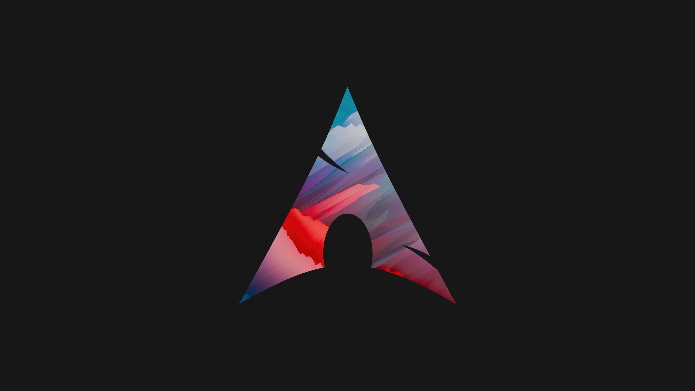

# All Wallpapers

### [🖼 Download Images](https://github.com/Basicprogrammer10/ArchPapers/archive/refs/heads/main.zip)

\- [Source Image](https://www.reddit.com/r/wallpaper/comments/m7x6a4/dreams_3440x1440), by James Sypniewski

This is the wallpaper that inspired this entire project.
Someone posted a [Gentoo wallpaper on reddit](https://www.reddit.com/r/linuxmasterrace/comments/mb466s/a_clean_gentoo_wallpaper) and people wanted an arch version. :P

`arch-papers source_image out.png -s 3840,2160 -t 915,0 --bg-scale 0.9`

---

\- [Source Image](https://www.reddit.com/r/wallpapers/comments/ukl6t1/fission_a1_3840x2160), by James Sypniewski

`arch-papers source_image out.png -s 3840,2160 -t 915,0 --bg-scale 0.9`

---

\- [Source Image](https://www.reddit.com/r/wallpaper/comments/rfl7vj/abstract_wave_3840x2160), by James Sypniewski

`arch-papers source_image out.png -s 3840,2160 -t 145,-120`

---

\- [Source Image](https://www.reddit.com/r/WidescreenWallpaper/comments/bz6ym2/fire_3440x1440), by James Sypniewski

`arch-papers source_image out.png -s 3840,2160 -d 15`

---

\- [Source Image](https://www.reddit.com/r/wallpapers/comments/tkhpx9/nautical_3840x2160), by James Sypniewski

`arch-papers source_image out.png -s 3840,2160 -t 515,-50`
